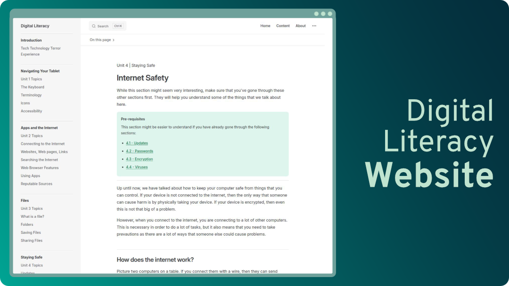
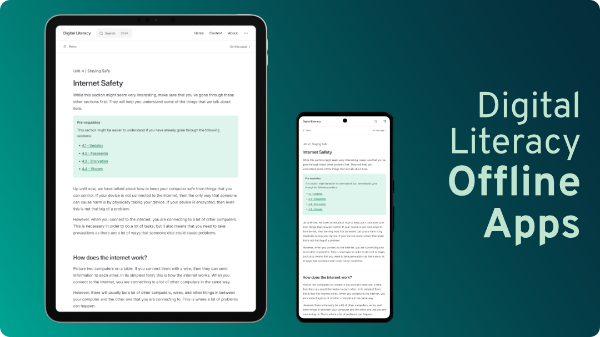

<h1 align="center">Digital Literacy</h1>

This is an arts based initiative by the UBC A.R.T. & Justice Research Project group, to support the well-being of people in prison. These lessons on digital literacy are designed to be accessible to anyone, regardless of their prior experience.

The focus of this project is to create an accessible and open-source digital literacy resource. The website is intended to be offline-friendly, and consistent with the content of the mobile version.

**View the website: [Digital Literacy](https://ubc-art-and-justice.github.io/digital-literacy/)**

    

**Download the Android app:**

We are still in the process of releasing the Android app to the Play Store and F-Droid.

In the meantime, you can download the `.apk` from the [releases page](https://github.com/UBC-ART-and-Justice/digital-literacy/releases). If you have experience with Android development, you can also build the app yourself by following the instructions in the [repository wiki](https://github.com/UBC-ART-and-Justice/digital-literacy/wiki/Modifying-the-Android-App-with-CapacitorJS).

    

## Technical Details

The website was created with Vitepress, and the Android app was built by adding Capacitor to the project. The website is hosted on GitHub Pages, and the Android app will be available as release APKs on this repository. Future iOS development and releases on app stores (Google Play, F-Droid, Apple App Store) are possible.

For setup and contribution guides, see the [repository wiki](https://github.com/UBC-ART-and-Justice/digital-literacy/wiki).
