Unit 4 | Staying Safe

# Internet Safety

::: details Previous content that will be useful to know

This section relies on information contained in the previous sections listed below. If you find this section difficult to understand, it may help to go back and review these past sections. Click on a link to go to the prerequisite section, or use the menu.

<!-- TODO: Add a link to the previous section on internet safety -->

- [4.1 - Updates](4.1-updates.md)
- [4.2 - Passwords](4.2-passwords.md)
- [4.3 - Encryption](4.3-encryption.md)
- [4.4 - Viruses](4.4-viruses.md)

:::

---

Up until now, we have talked about how to keep your computer safe from things that you can control. If your device is not connected to the internet, then the only way that someone can cause harm is by physically taking your device. If your device is encrypted, then even this is not that big of a problem.

However, when you connect to the internet, you are connecting to a lot of other computers. This is necessary in order to do a lot of tasks, but it also means that you need to take prevautions as there are a lot of ways that someone else could cause problems.

## How does the internet work?

Picture two computers on a table. If you connect them with a wire, then they can send information to each other. In its simplest form, this is how the internet works. When you connect to the internet, you are connecting to a lot of other computers in the same way.

However, there will usually be a lot of other computers, wires, and other things in between your computer and the other one that you are connecting to. This is where a lot of problems can happen.

::: details What actually happens when I visit a website?

Say that you want to visit a bookstore website on the internet, in order to buy a book.

When you visit that website, your computer will connect to another computer. That other computer is called a "server" because it contains some information (in this case the bookstore website) and it is ready to give that information to anyone who asks for it.

Once your computer connects to the server, it will ask for the information that it needs, such as the pictures of the books or the prices. The server will then send this information back to your computer. These messages will constantly go back and forth in the background.

<!-- TODO: REPLACE WITH IMAGES -->

However, as we mentioned before, those messages will likely pass through a lot of other computers and wires, while on the way to the server and back. Some of these computers might be trying to read the information that is passing through, or they might even try to change the information.

```mermaid
graph LR
A(((Your computer))) -->|information| C((Computer 2));
C -->|information| D(("`👁️👁️
Computer 3`"));
D -->|information| B{Website Server};
B --> D;
D --> C;
C --> A;
style D fill:#f96,stroke:#333,stroke-width:2px;
```

<!-- TODO: REPLACE WITH IMAGES -->

For example, you might not want anyone else to know what book you want to buy. It is also dangerous if you try to buy the book, and someone else sees your credit card or bank information.
:::

## Wi-Fi Networks and connecting securely

When you want to connect to the internet, all you really need to think about is how you are connecting to it within your home, in the same way that you don't need to think about how the phone system works other than when you are connecting your phone to the wall.

While computers can connect to the internet using wires, and it is still common to do so using a wire called an "ethernet cable", it is also possible to connect wirelessly. This is called a "Wi-Fi" connection, and it is a similar technology to radio signals.

<!-- TODO: REPLACE WITH IMAGES -->

When you are using a Wi-Fi network, your device is sending information to a device called a "router", which is then connected to the internet. This makes it easy to connect many different devices to the internet quickly, without needing to run a wire to each one. You can also move around with your device, and still stay connected to the internet.

### **Problem: Fake Wi-Fi networks**

It is possible to set up a Wi-Fi network in a way that someone can see all the information that is being sent through it.

```mermaid
graph LR
A(((Your computer))) -->|bad Wi-Fi| B[/"`👁️👁️
                                        bad router`"\];
B --> C{rest of the internet};
C --> B;
B --> A;
A ~~~ D[/real router\];
style B fill:#f96,stroke:#333,stroke-width:2px;
```

<!-- TODO: REPLACE WITH IMAGES -->

When you want to connect a new device to a Wi-Fi network, your device to look for any networks that are nearby (similar to how there are many radio stations that you can tune into). If you are connecting to the network in your home, then you should be familiar with the name of the network.

However, say that you are visiting a coffee shop called "Joe's Coffee". When you try to connect to the Wi-Fi network, you might see the following networks:

> **:material-wifi: Joe's Coffee Free Wi-Fi**
>
> **:material-wifi: Orange Joe's Coffee**
>
> **:material-wifi: Free wifi by Joe**

Which one is the real one and which one's might be trying to trick you? Unless you find a sign in the shop or you ask one of the employees, you SHOULD NOT connect to any of them. As you get more experience, you might be able to tell which ones are real and which ones are fake.

## HTTPS and secure connections

Due to how common these problems were, most websites and web browsers automatically make sure that you have a "secure connection". You can confirm that this is happening on the website that you are looking at by checking if you can see “https” instead of “http” in the URL.

::: details How does this work

<!-- TODO: diagram, including one with the extra computers in between -->

When you make a secure connection, your computer and the website will agree on a secret code (see [encryption](4.3-encryption.md) from before). If someone was on the network trying to look at the data going by, they would not understand what was happening. All they could see is that you made a secure connection to that website, and that a lot of encrypted information was going back and forth.

http:

```mermaid
graph LR
A(((Your computer))) -->|credit card #| C((Computer 2));
C -->|credit card #| D(("`👁️👁️
Computer 3`"));
D -->|credit card #| B{Website Server};
B --> D;
D --> C;
C --> A;
style D fill:#f96,stroke:#333,stroke-width:2px;
```

<!-- TODO: REPLACE WITH IMAGES -->

https:

```mermaid
graph LR
A((("`Your computer
(credit card # = ****)`"))) -->|****| C((Computer 2));
C -->|****| D(("`👁️👁️
Computer 3`"));
D -->|****| B{"`Website Server
(**** = credit card #)`"};
B --> D;
D --> C;
C --> A;
style D fill:#f96,stroke:#333,stroke-width:2px;
```

<!-- TODO: REPLACE WITH IMAGES -->

:::

## VPNs

A VPN, which stands for "Virtual Private Network", is a tool that changes the structure of an internet connection. It usually involves sending all of the data through an extra computer before it goes out to the internet.

You will often see advertisements for VPNs which promise to keep you safe. However, **most of the time you DO NOT need a VPN**. Most websites already use HTTPS, which is a secure connection. Unless you are in one of the situations below, it is unnecessary to use a VPN and it might even make things worse because you will be sending all of the information through the untrustworthy VPN.

### **When can a VPN help:**

1. **The website requires it for security**

   Some schools and businesses will require that you use their VPN when connecting. If this is the case, they will usually help you set everything up. You might need the VPN all the time, or only while traveling away from the school or business. This is an extra security measure that they are taking, and this is often because they will block any connections that are from outside of their network (unless it is done through the VPN)

2. **If you don’t want someone to know what website you connected to**

   When you connect to a website with “https”, your information is secure, but someone can still see that you are connected to the website. For example, this can be a problem if you are at school or coffee shop and you don't want them to know what website you are using.

3. **If you don’t want the website to know where you connected from**

   Similar to point 2, the website can see where you are connecting from. Sometimes, a website won’t let people from a certain country look at the content. This can be a problem if you are traveling and want to watch a video or read an article that is only available in your home country. Using a VPN can get around this.

In most places in the world, a VPN is legal and safe for you to use. A lot of students and businesses use VPNs for their day to day tasks. However, you should check the local rules, such as when traveling to a different country.

### **How to choose a good VPN**

When you use a VPN, you will be sending all your data to that VPN. If the VPN is not trustworthy, they can see a lot of information.

When you are looking for a VPN, you can reach out to someone you trust for recommendations, such as a local library. Some recommended resources (as of May 2024) include:

- Proton VPN
- Mullvad VPN
- The privacyguides.org recommendations list. While you can't access this right now, this is a good resource to check in the future.

<!-- TODO
??? extra-info "How does a VPN work?"

Say you want to connect to a website, it might look like this
You -- website
When you use a VPN:
You <	> VPN <	> website
If someone is looking at you, all they can see is that you connected to the VPN
If someone is looking at the website, all they can see is that a VPN is connected to it.

see https://www.privacyguides.org/en/basics/vpn-overview/
 -->

## Two Factor Authentication

Sometimes where you need to make an account for something important, such as your bank, you will be required to set up something called `Two Factor Authentication`, or ‘2FA’

You can think of this as putting a second lock on a door.

- The first lock can be opened by your password, same as always
- The second lock can be opened using some other method

If someone gets a hold of your password, they still can't get in because there is a second lock.

::: details If I don't tell anyone my password, then how can someone get it?

There are a number of techniques that someone can use to get your password even without you telling them. Here are some examples:

- Someone might try guessing many different passwords until they find the right one
- Someone might break into the website or organization itself, and steal everyone's passwords.

This is why it's helpful to have 2FA set up, even though it might seem like extra work. This is also why it is important to use a different password for each account that you have.
:::

**So what is this other lock?**

It depends on the account, but usually someone will be available to help you set it up. Some common methods include:

- **Text message**: When you try to log in, the system will send a text message to your phone with a code. You will need to enter this code in order to log in.
- **Phone call**: When you try to log in, the system will call you and play a message with a code. You will need to enter this code in order to log in.
- **OTP**: You might be asked to download an app. When you try to log in, the app will show you a code that you need to enter in order to log in. This code will change every 30 seconds, but the system will know what the code is supposed to be.

::: details Which method is the best?

You should pick the method that you are most comfortable with, as this will ensure that you can use it when you need to.

If you want to pick the most secure method, then you should use a mobile app (OTP).

- Text messages and phone calls are older technologies, and they can be intercepted by someone who has the time and equipment to do so. For most people, this is not something to worry about, but it is something to keep in mind when you are choosing.
- The OTP app is more secure because there is no way for someone to intercept the code that is being sent to you. The code is generated on your phone, and it is only valid for a short amount of time. Even if someone gets the code, there is no way for them to figure out what the next code will be.
  :::

<!-- TODO: how does OTP work -->

::: details If I get to pick an app, which app should I download?

It would be best to check with someone you trust, in case this information becomes outdated. However, as of May 2024, some recommended apps include:

- **Aegis Authenticator**: This app is available on Android phones
- **Ente Auth**: This app is available on most devices
  :::

<!-- TODO: add an image of MFA? -->

## Things to keep an eye out for

The good news is that most computers and online accounts are very secure, and it’s very difficult for someone to break in without you knowing. However, that means that most of the time, someone will try to trick you into letting them in so that they can take your money or information.

This happens in the real world as well, but on the internet, it is even easier for someone to do to this. Here are some reasons why:

- It is easy to hide. Since you can't see the person, they can pretend to be anyone. They can also change their identity very easily.
- It is easy to scam many people at once. If they trick someone in person, they can only trick one person at a time. On the internet, they can create something that tricks many people at once. They don't even have to be around when the trick happens.

### Scams

Here are some things to look for:

- **Urgency**: They will try to make you feel like you need to act quickly. They might say that your computer is infected with a virus, or that your bank account is going to be locked.
- **Too good to be true**: They might say that you have won a prize, or that they want to give you money. If it seems too good to be true, it probably is.
- **Typos**: They might make mistakes in their message. Sometimes this is done on purpose, so that they can focus on the people who don't notice the mistakes, as they might be easier to trick.

It can be hard to identify scams, and even experienced people fall for them. That’s why they are so common. With some practice, you will start to know which ones look suspicious. See below for some common scams, and the reasons why they are suspicious.

::: details Your computer is infected with a virus! Click here for immediate help.

This is suspicious because:

- It is urgent
- They are trying to get you to click on something

What you should do:

- If you think that your computer is infected, you should ask someone you trust for help. They will be able to help you figure out if it is a real problem or not.
- If you are worried, you should contact the company that they are pretending to be. They will be able to tell you if there is a problem or not.
- DO NOT click on any links or send them any information. Close the email or message, and then search for the company's contact information on your own.
  :::

::: details Important Security Alert: Your account will be locked unless you verify your information now.

This is suspicious because:

- It is urgent
- They are trying to get you to give them your information

What you should do:

- If you are worried, you should contact the company that they are pretending to be. They will be able to tell you if there is a problem or not.
- DO NOT click on any links or send them any information. Close the email or message, and then search for the company's contact information on your own.
  :::

::: details Congratulations! You've won a $1,000 gift card. Claim your prize by clicking the link.

This is suspicious because:

- It is too good to be true
- They are trying to get you to click on something

What you should do:

- Unless you remember entering a contest, you should ignore the message. No one is going to give you money for free, as exciting as it might sound.
- If you did enter a contest, you should reach out to the contest people yourself to check if you won.
  :::

::: details Urgent: Your bank account has been compromised. Please login now to secure it.

This is suspicious because:

- It is urgent
- They are trying to get you to give them your information

The bank will never ask you to give them your information in this way. If you are worried, you should look for the bank's phone number, such as on the back of your bank card, and call them to ask if there is a problem.

DO NOT click on any links or send them any information. Even if you click on a link and it looks like the bank's website, it might be a fake website that is trying to trick you. See the section on phishing below for more information.
:::

::: details A package is waiting for you! Click to confirm your delivery details.

Unless you ordered something and you are expecting a package, you should ignore this message.

If you did order something, look at the email address that the message came from. See below for more information on how to check if an email is suspicious.
:::

### Phishing

This is a special type of scam where someone will make a website or an email that looks very similar to the real ones. The only way to get good at spotting these is to practice. After some time, you’ll start to know what a website and email is supposed to look like.

#### Websites

The best way to check if a website is “phishing” is to look at the start of the address at the top. If it doesn’t perfectly match what you are used to seeing, don’t click anything

<!-- TODO: add image -->

#### Emails

The best way to check if someone is a “phishing” email is to look at the sender’s address.

<!-- TODO: add image -->

If it doesn’t perfectly match what you are used to seeing, don’t click anything. If you do not recognize the email/person emailing, do not respond.

Your email program will try to help you by sending the suspicious emails to a folder called “SPAM”. Sometimes it makes mistakes, but these days it is usually very good at catching the bad emails.

**Malicious Files**

Instead of trying to get you to click a link, or send them information, another scam is where they will send you a file that looks harmless. Unless you know the person and are expecting a file:

- DO NOT click on the file
- DO NOT open the file
- DO NOT download the file

If your email program or your computer gives you a warning, don’t try to open the file. Check with someone you trust to make sure that it is safe.

## Best Practices on the Internet

### Adblockers

When you start using the internet, you will notice that there are so many annoying advertisements everywhere. Even worse, these advertisements might try to trick you.

The ads that you see on a website were not created by the website itself. Most often, the website doesn't even know what ads are being shown. They mark a space on the website where the ad should go, and then a different company will put an ad there. Even if you trust the website, the ads might be untrustworthy

Adblockers will prevent the ads from appearing.

- You can think of it like the mesh screen door that keeps bugs out of your house.
- The adblockers are free to use, and you can ask someone you trust to help you install one

As of 2024, the recommended adblocker is called ‘Ublock Origin’. While there are others out there, they aren't as safe or as effective.

### Online Privacy

You might hear people say that we are living in the 'information age'. This is because there is so much information about us that is available, and there are different groups and companies that want to get that information.

It is best to keep as much information private as possible. Here are some things to keep in mind:

- You often don't need to give your real name or address when you are signing up for something. A lot of websites will ask for this information, but you can either skip it or make something up.
- Deleting something from the internet is very hard. Even if you delete something, someone might have saved it before you did. There are even programs that quickly save everything it can from the internet, just in case. It's best to not put something on the internet that you wouldn't want others to see.

### **Shopping**

With a lot of stores, you can now shop and buy things from your computer. There will be a website where you can see each of the items, and you can click on the things that you want to buy. When you are ready to pay for the items, they will ask you to type in your credit card information. After you do this, the items will be sent to you in the mail.

<!-- TODO: add images -->

This is a very common and convenient way to shop, but here are some things to keep in mind:

- **Trusted Stores:** Just like how you might avoid stores you don’t trust in the real world, you should also avoid stores you aren't familiar with online.
  - In real life, it is easier to figure out if a store is trustworthy. Online, it is hard because anyone can set up a nice-looking store very quickly, and then disappear after taking your money.
  - It is best to stick to the stores that you know and trust. You can ask someone you trust for recommendations if you are looking for something new.
